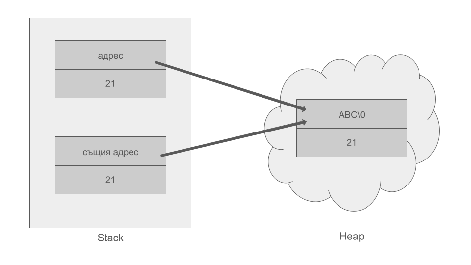

<h1 align="center">ООП - Практикум - 26.03.2025 - Седмица 06</h1>

## Голяма четворка

При **default**-но генерираните **К.К** и **ОП=** от компилатора, ако в обекта имаме динамична памет, се създава **shallow copy** на обекта, т.е имаме два различни обекта, които сочат към една и съща динамична памет

Това води до два проблема:
- При промяна на данните в единия обект, се променят и при другия;
- Извиква се деструктор два пъти, което води до грешка, понеже не можем да изтрием данни, които вече са били изтрити;

Затова, при динамична памет, експлицитно си разписваме **K.K** и **ОП=**, които да се грижат за нашите данни

Ако не разпишем експлицитно деструктор, компилаторът създава такъв автоматично, но автоматично генерираният не унищожава външните ресурси, а само указателя, който сочи към тях

Голямата четворка в себе си включва:
- Default конструктор;
- Копиращ конструктор (К.К);
- Оператор= (ОП=);
- Деструктор;

Не пишем голяма четворка, когато за член-данни имаме:
- Агрегация;
- Function pointers;
