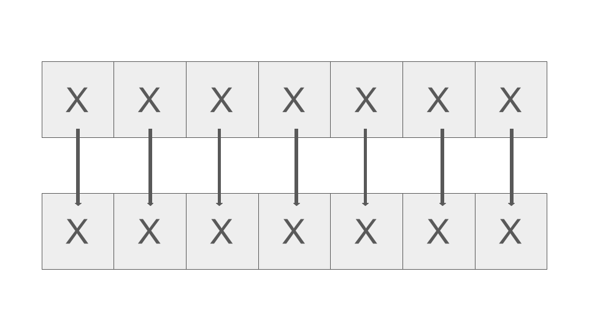
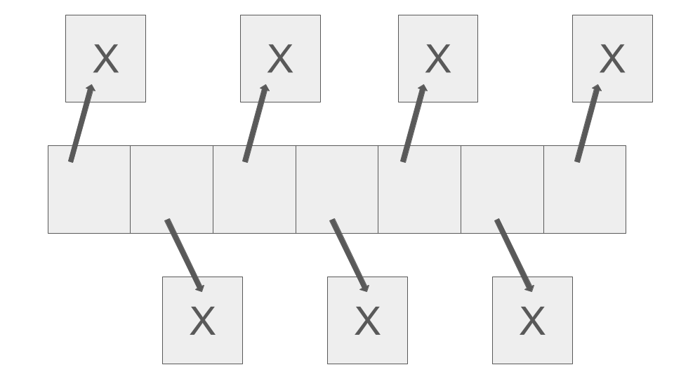

<h1 align="center">ООП - Практикум - 16.04.2025 - Седмица 09</h1>

## Видове колекции

### Масив от обекти

```c++
X* data = new X[N];
```

- Плюсове:
  - **Locality**: адресите на съседните елементи в колекцията са разположени последователно в паметта, като по този начин се подобрява бързодействието при итериране и четене

- Минуси:
  - Използва се повече памет
  - **resize** прави излишни копия



### Масив от указатели към обекти

```c++
X** data = new X*[N];
```

- Плюсове:
  - Бързи **swap**-ове (swap на указатели)
  - Няма нужда от **default constructor**
  - Имаме неутрална стойност **nullptr**
  - Използва се по-малко памет
  - **resize** прави `ОП=` само върху указателите
 
- Минуси:
  - Нямаме **locality**, което е и основната причина колекции от първия вид да са за предпочитане
 


## Move семантики

- Не се правят излишни копия, а се "крадат" данни

```plaintext
          glvalue          rvalue
        /        \        /      \
  lvalue           prvalue        xvalue
```
| lvalue                           | prvalue                          | xvalue                               |
| -------------------------------- | -------------------------------- | ------------------------------------ |
| променливи                       | литерали                         | обекти към края на жизнения си цикъл |
| функции, които връщат референция | функции, които връщат копие      |                                      |
| постоянен адрес                  |                                  |                                      |

```c++
f(X obj);        // lvalue и rvalue
g(X& ref);       // lvalue
h(const X& obj); // lvalue и rvalue
t(X&& obj);      // rvalue
```

### Move конструктор (М.К)

- Член-функция, която за параметър приема обект от същия клас **(rvalue reference)**, като текущият "краде" неговите данни **(текущият не е съществувал)**

```c++
struct X
{
        Y y;
        Z z;

        X(X&& other) noexcept :
                y(std::move(other.y)),
                z(std::move(other.z)) {}
}
```

### Move оператор= (М.ОП=)

- Член-функция, която за параметър приема обект от същия клас **(rvalue reference)**, като текущият вече съществува и "краде" неговите данни

```c++
struct X
{
        Y y;
        Z z;

        X& operator=(X&& other) noexcept :
                if (this != &other)
                {
                        y = std::move(other.y);
                        z = std::move(other.z);
                }

                return *this;
        }
}
```

### Извикване на move конструктори / деструктори

```c++
f(X&& ref);
g(X obj);

{
        X obj; // X()
        f(std::move(obj)); // нищо
        g(std::move(obj)); // М.К X(), ~X()
} // ~X()
```

```c++
{
        String s1 = "ABC"; // String(const char*)
        String s2(std::move(s1)); // M.K String()
        String s3;
        s3 = std::move(s2); // М.ОП= String()
}
```

### std::move

- Преобразува: **lvalue => xvalue**
- Индикира, че обектът няма да се използва извън рамките на функцията

### Добавяне на елементи към колекция

```c++
add(const X& obj)
{
        this->data[this->size++] = obj;
}

add(X&& obj)
{
        this->data[this->size++] = std::move(obj);
}
```

- В рамките на функцията `X&&` се разглежда като **lvalue** и затова трябва да използваме `std::move`

### Голяма шестица

- Default конструктор
- Копиращ конструктор и Move конструктор
- Оператор= и Move оператор=
- Деструктор

### Автоматично генерирани конструктори

- Default конструктор се генерира автоматично, ако няма дефинирани други конструктори
- Ако забраним копиращ конструктор => забраняваме move конструктор
- Ако забраним move конструктор => забраняваме копиращ конструктор
- Копиращ конструктор и оператор= се генерират автоматично, ако няма дефинирани move конструктор или move оператор=
- Move конструктор и move оператор= се генерират автоматично, ако няма дефинирани копиращ конструктор, оператор= или деструктор
- Деструктор се генерира автоматично, ако няма разписан такъв
