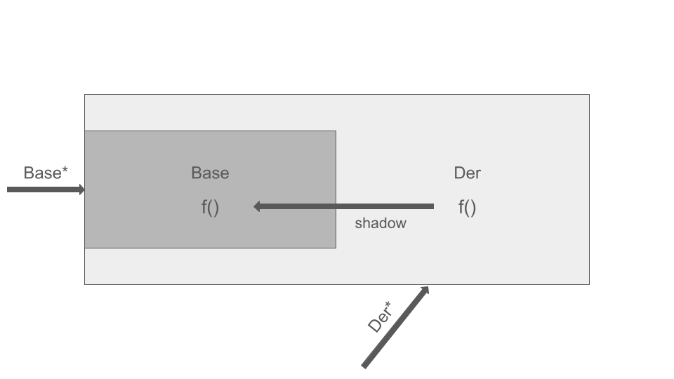
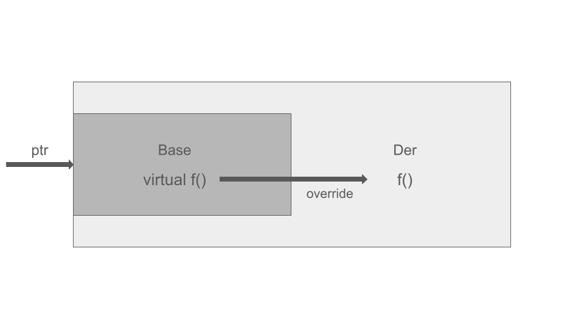

<h1 align="center">ООП - Практикум - 30.04.2025 - Седмица 11</h1>

## Полиморфизъм

- Едно име на функция, но много различни имплементации

### Compile-time Polymorphism (Статично свързване)

- Изборът на функция, която трябва да се изпълни, става по време на компилация
- Определя се от указателя / референцията, от който се извиква функцията

#### Function overloading

```c++
f()
f(int)
f(int, int)
```

#### Operator overloading

```c++
friend bool operator<(const Pair& lhs, const Pair& rhs)
{
        return lhs.x < rhs.x || (lhs.x == rhs.x && lhs.y < rhs.y);
}
```

#### Извикване на методи

```c++
class Base
{
public:
        void f() { std::cout << "Base::f()" << std::endl; }
}

class Der : public Base
{
public:
        void f() { std::cout << "Der::f()" << std::endl; }
}
```

```c++
void K(Base* ptr) { ptr->f(); }
void S(Der* ptr) { ptr->f(); }

Der d;
d.f(); // Der::f()
K(d);  // Base::f()
S(d);  // Der::f()
```



## Runtime Polymorphism (Динамично свързване)

- Изборът на функция, която трябва да се изпълни, става по време на изпълнение на програмата
- Изпълнява се посредством виртуални таблици

### Виртуална функция

- Член-функция, която е дефинирана в базовия клас с ключовата дума **virtual**
  - Не могат да бъдат **static**
  - Прототипът на виртуалните функции трябва да съвпада в базовия клас и неговите наследници
  - Винаги се дефинират в базовия клас, като се предефинират в наследниците
  - Не е задължително една виртуална функция да се предефинира в своите наследници, като тя може да има **default**-но поведение за всички свои наследници, дефинирано в базовия клас
  - Достъпът до виртуални функции трябва да се извършва чрез указател / референция към базовия клас, за да се осъществи runtime polymorphism
  - При наличие на виртуални функции, деструкторът на базовия клас задължително трябва да бъде **virtual**

#### Извикване на методи

```c++
class Base
{
public:
        virtual void f() { std::cout << "Base::f()" << std::endl; }
        virtual ~Base() = default;
}

class Der : public Base
{
public:
        void f() override { std::cout << "Der::f()" << std::endl; }
}
```

```c++
Der d;
d.f(); // Der::f()

Base* ptr = &d;
ptr->f(); // Der::f()
```



### Чисто виртуална функция (Pure-virtual function)

- Виртуална функция без имплементация
- Предназначението и е да бъде презаписвана от всички свои наследници

```c++
virtual void f() = 0;
```

### Абстрактен клас

- Клас с поне една чисто виртуална функция
- Ако даден клас не презапише виртуална функция, то той също става абстрактен
- Не можем да създаваме обекти от абстрактни класове

```c++
class Base
{
public:
	virtual void f() = 0;
	virtual ~Base() = default;
};

class A : public Base
{
public:
	void f() override;
};

class B : public Base {}; // абстрактен клас

class C : public Base
{
public:
	void f() override;
};
```

### Ключови думи override и final

- **override** - индикира, че даденият метод ще бъде презаписан, предпазва от грешки

|                            | final                                                                          |
| -------------------------- | ------------------------------------------------------------------------------ |
| Виртуални функции          | наследниците на текущия клас не могат да презапишат дадената виртуална функция |
| Класове                    | ако даден клас се обозначи като **final**, то той не може да се наследява      |

### Виртуални таблици

- Масив от указатели към функции (неточна дефиниция)
- Ако в един клас има поне една виртуална функция, то за него и всички негови наследници се създава виртуална таблица. Във виртуалната таблица се указва коя е правилната функция, която трябва да се извика.
Всеки клас, към който добавим виртуална функция, скришно се добавя и член-данна с указател към неговата виртуална таблица - **__vfptr**, който **заема допълнителна памет**. Обаче къде е разположен той - в началото, средата или края не е еднозначно определено

```c++
class A
{
public:
	virtual void f() { std::cout << "A::f()" << std::endl; }
	virtual void g() { std::cout << "A::g()" << std::endl; }
};

class B : public A
{
public:
	void f() override { std::cout << "B::f()" << std::endl; }
};

class C : public B
{
public:
	void f() override { std::cout << "C::f()" << std::endl; }
	void g() override { std::cout << "C::g()" << std::endl; }
};
```

#### VTable A

```c++
A::f();
A::g();
```

#### VTable B

```c++
B::f();
A::g();
```

#### VTable C

```c++
C::f();
C::g();
```

### Полиморфна йерархия

- За общ родител на всички наследници имаме абстрактен клас
- При полиморфна йерархия задължително трябва в базовия клас да имаме виртуален детруктор
- При полиморфна йерархия, компилаторът прави следното - обхожда, тръгвайки от базовия клас, продължава с всички класове, които участват в йерархията, и
за всеки един от тях създава виртуална таблица с "правилните" виртуални функции. Благодарение на това, при колекции от полиморфни обекти, при извикване на
деструктора на базовия клас, той рекурсивно извиква деструктора на своите наследници

#### Пример с геометрични фигури

```plaintext
                                                    Shapes
                                                    Point*
                                    virtual double getArea() const = 0;
                                    virtual double getPerimeter() const;
                /                                      |                                    \
            Circle                                Rectangle                                Triangle
    getArea() const override;              getArea() const override;               getArea() const override;
  getPerimeter() const override;
```

| VTable               | Circle                 | Rectangle              | Triangle               |
| -------------------- | ---------------------- | ---------------------- | ---------------------- |
| getArea() const      | Circle::getArea()      | Rectangle::getArea()   | Triangle::getArea()    |
| getPerimeter() const | Circle::getPerimeter() | Shapes::getPerimeter() | Shapes::getPerimeter() |

#### Извикване на методи от полиморфна колекция

```c++
Shapes** data = new Shapes*[N];

for (size_t i = 0; i < N; i++)
{
        std::cout << data[i]->getArea() << std::endl;
}
```

1. Дереферираме **data[i]**
2. Дереферираме **__vfptr**
3. Извикваме функцията с преобразуван указател
