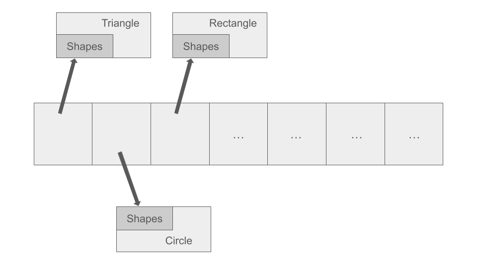
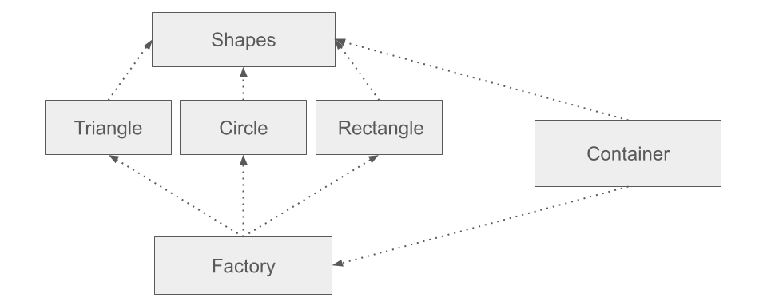
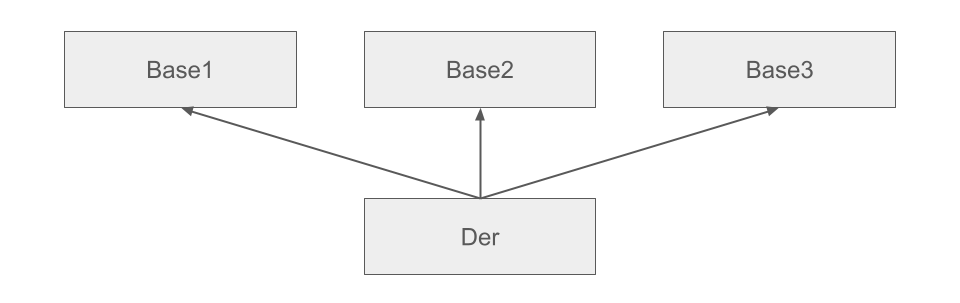
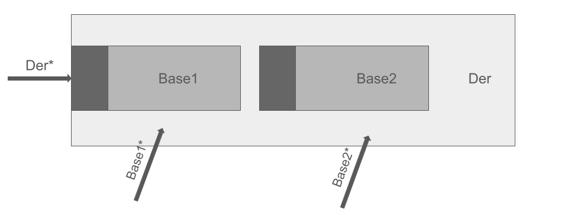
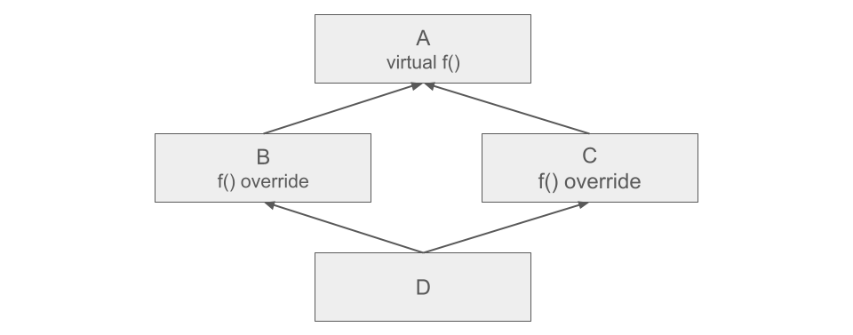
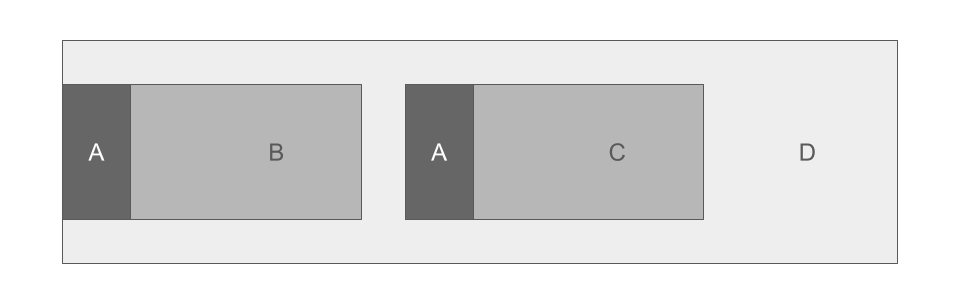
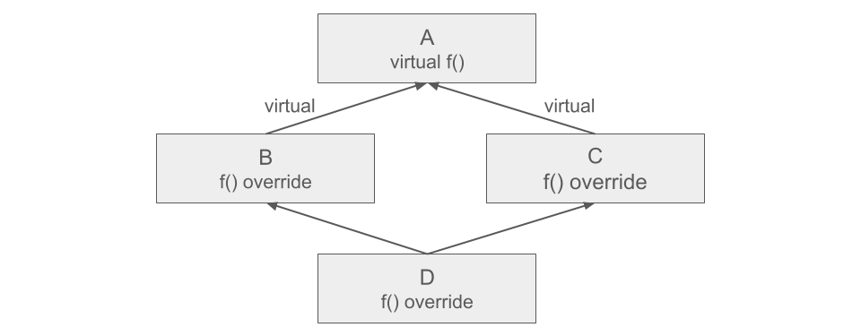
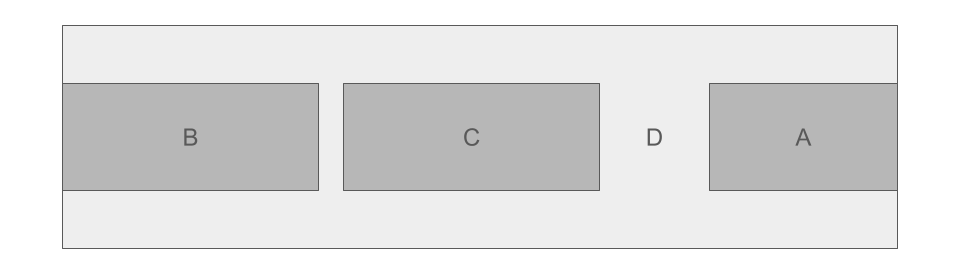

<h1 align="center">ООП - Практикум - 07.05.2025 - Седмица 12</h1>

## Хетерогенен контейнер

- Масив от указатели към базов клас (полиморфни обекти)

```c++
Shapes** data = new Shapes*[N];
```




### Триене

- Чрез извикване на виртуален деструктор
- Компилаторът обхожда класовете в полиморфната йерархия, започвайки от базовия клас към неговите наследници, като за всеки един от тях създава виртуална таблица с виртуалните функции, които трябва да се извикват.
Следователно, при извикване на деструктор от базовия клас, той рекурсивно извиква деструктор на всички свои наследници

```c++
~Shapes() => ~Triangle()
```

### Копиране

- Чрез клонираща функция

```c++
class Shapes
{
public:
	virtual Shapes* clone() const = 0;
};

class Triangle : public Shapes
{
public:
	Shapes* clone() const override
	{
		return new Triangle(*this);
	}
};

class Rectangle : public Shapes
{
public:
	Shapes* clone() const override
	{
		return new Rectangle(*this);
	}
};

class Circle : public Shapes
{
public:
	Shapes* clone() const override
	{
		return new Circle(*this);
	}
};
```

```c++
Container(const Container& other)
{
	this->container = new Shapes * [other.getCapacity()];

	for (size_t i = 0; i < other.getCapacity(); i++)
	{
		this->container[i] = other.container[i]->clone();
	}
}
```

### Конкретика

- Само във **Factory** методите
- Ще дефинираме следната релация **X --> Y** (X знае за Y)

```c++
class ShapesFactory
{
private:
	static Shapes* triangleFactory()
	{
		Point p1, p2, p3;
		std::cin >> p1 >> p2 >> p3;

		return new Triangle(p1, p2, p3);
	}

	static Shapes* rectangleFactory()
	{
		Point p1, p3;
		std::cin >> p1 >> p3;

		return new Rectangle(p1, p3);
	}

	static Shapes* circleFactory()
	{
		Point p;
		int radius;
		std::cin >> p >> radius;

		return new Circle(p, radius);
	}

public:
	static Shapes* shapeFactory(ShapeType shapeType)
	{
		switch (shapeType)
		{
		case ShapeType::TRIANGLE: return triangleFactory();
		case ShapeType::RECTANGLE: return rectangleFactory();
		case ShapeType::CIRCLE: return circleFactory();
		}
	}
};
```



### Разпознаване

- Чрез допълнителна член-данна **enum class** или **dynamic_cast**

```c++
Container c;

// Вариант 1
c.add(ShapeType::TRIANGLE)

// Вариант 2
c.add(ShapesFactory::shapeFactory(ShapeType::TRIANGLE))
```

### Взаимно разпознаване

- **Visitor Pattern**
- **A <=> B**
- **B <=> C**
- **A <=> C**

```c++
enum class ShapeType
{
	TRIANGLE,
	RECTANGLE,
	CIRCLE
};

class Triangle;
class Rectangle;
class Circle;

class Shapes
{
public:
	virtual bool intersect(const Shape* shape) const = 0;

	virtual bool intersectWith(const Triangle* shape) const = 0;
	virtual bool intersectWith(const Rectangle* shape) const = 0;
	virtual bool intersectWith(const Circle* shape) const = 0;

	virtual ~Shape() noexcept = default;
};
```

```c++
class Triangle : public Shapes
{
public:
	bool Triangle::intersect(const Shape* shape) const
	{
		return shape->intersectWith(this);
	}

	bool Triangle::intersectWith(const Triangle* shape) const
	{
		std::cout << "Triangle + Triangle" << std::endl;
		return true;
	}

	bool Triangle::intersectWith(const Rectangle* shape) const
	{
		std::cout << "Triangle + Rectangle" << std::endl;
		return true;
	}

	bool Triangle::intersectWith(const Circle* shape) const
	{
		std::cout << "Triangle + Circle" << std::endl;
		return true;
	}
};
```

```c++
class Rectangle : public Shapes
{
public:
	bool Rectangle::intersect(const Shape* shape) const
	{
		return shape->intersectWith(this);
	}

	bool Rectangle::intersectWith(const Triangle* shape) const
	{
		std::cout << "Rectangle + Triangle" << std::endl;
		return true;
	}

	bool Rectangle::intersectWith(const Rectangle* shape) const
	{
		std::cout << "Rectangle + Rectangle" << std::endl;
		return true;
	}

	bool Rectangle::intersectWith(const Circle* shape) const
	{
		std::cout << "Rectangle + Circle" << std::endl;
		return true;
	}
};
```

```c++
class Circle : public Shapes
{
public:
	bool Circle::intersect(const Shape* shape) const
	{
		return shape->intersectWith(this);
	}

	bool Circle::intersectWith(const Triangle* shape) const
	{
		std::cout << "Circle + Triangle" << std::endl;
		return true;
	}

	bool Circle::intersectWith(const Rectangle* shape) const
	{
		std::cout << "Circle + Rectangle" << std::endl;
		return true;
	}

	bool Circle::intersectWith(const Circle* shape) const
	{
		std::cout << "Circle + Circle" << std::endl;
		return true;
	}
};
```

#### Проблеми

- Родителят знае за наследниците си
- Решението е да направим **forward декларация** на наследниците на базовия клас в хедъра на базовия клас, като по този начин обещаваме, че при **Linking** фазата по време на компилация ще съществуват такива класове

## Множествено наследяване

- Дефинираме клас, който разширява поведението и член-данните на повече от един базови класове
- Когато имаме множествено наследяване, към всеки обект се добавя допълнителен елемент - **(Δ - функция)**, която пресмята какво отместване да направи указателят, за да достъпи правилния обект
- **Δ** в себе си съдържа както **sizeof()**, така и **padding alignment**



```c++

Der d;

Base1* ptr1 = &d;
Base2* ptr2 = &d;
Base3* ptr3 = &d;
```

### Конструктори при множествено наследяване

- Пермутирането в инициализиращия списък е без значение, интересува ни по какъв начин са подредени класовете при наследяването

```c++
class Der : public Base1, Base2, Base3
{
        A obj1;
        B obj2;
}
```

#### Извикване на конструктори

```c++
Base1(), Base2(), Base3(), A(), B(), Der()
```

#### Копиращ конструктор

```c++
Der(const Der& other) :
        base1(other),
        base2(other),
        base3(other),
        obj1(other.obj1),
        obj2(other.obj2) { }
```

#### Оператор=

```c++
Der& operator=(const Der& other)
{
        if (this != &other)
        {
                Base1::operator=(other);
                Base2::operator=(other);
                Base3::operator=(other);
                free();
                copyFrom(other);
        }

        return *this;
}
```

#### Move конструктор

```c++
Der(Der&& other) noexcept :
        base1(std::move(other)),
        base2(std::move(other)),
        base3(std::move(other)),
        obj1(std::move(other.obj1)),
        obj2(std::move(other.obj2)) { }
```

#### Move оператор=

```c++
Der& operator=(Der&& other) noexcept
{
        if (this != &other)
        {
                Base1::operator=(std::move(other));
                Base2::operator=(std::move(other));
                Base3::operator=(std::move(other));
                free();
                moveFrom(std::move(other));
        }

        return *this;
}
```

### Деструктори при множествено наследяване

- Деструкторите се извикват в обратен ред на конструкторите

#### Извикване на деструктори

```c++
~Der(), ~B(), ~A(), ~Base3(), ~Base2(), ~Base1()
```

### Виртуални таблици при множествено наследяване

```plaintext
          Base1              Base2
      virtual f();        virtual f();
                          virtual g();
                \          /
                    Der
                f() override;
```

- **Der** задължително трябва да презапише **f()**



| Base1*    | Δ             |
| --------- | ------------- |
| Der::f()  | -Δ(Base1) = 0 |

| Base2*     | Δ         |
| ---------- | --------- |
| Base2::g() | 0         |
| Der::f()   | -Δ(Base2) |

## Диамантен проблем



- В класа **D** сме задължени да презапишем **f()**
- В следната ситуация имаме потенциален проблем, защото се получава дублиране на памет при създаването на класа **A**. Решението на този проблем е да използваме виртуално наследяване

#### Представяне в паметта



#### Извикване на конструктори

```c++
A(), B(), A(), C(), D()
```

#### Извикване на деструктори

```c++
~D(), ~C(), ~A(), ~B(), ~A()
```

### Виртуално наследяване

- За да избегнем дублиране на памет, можем да използваме виртуално наследяване. Когато клас наследява виртуално друг клас, всички наследници надолу по йерархията са длъжни да инстанцират
първия клас (най-отгоре в йерархията). Ако това не го направим, се извиква **default** constructor, дори някой от наследниците по йерархията да извиква конструктор с параметри

```c++
class X : virtual Y { };
```

- Всеки наследник на **X** (пряк и непряк) е отговорен за създаването на **Y**
- Очакваме обектът **Y** да се споделя и от други наследници



#### Представяне в паметта



#### Извикване на конструктори

- След добавяне на **virtual**, преди да се извика конструктор на родител, се прави проверка дали този конструктор вече не е бил извикан

```c++
A(), B(), C(), D()
```

#### Извикване на деструктори

- Деструкторите се извикват в обратен ред на деструкторите, като там се прави същата проверка дали деструкторът вече е извикан

```c++
~D(), ~C(), ~B(), ~A()
```

## Теоретична задача

```plaintext
                      A
          virtual f(), g(), h(), k()
              /                \
          B                        C
    g() override()             f() override
              \                /
                      D
                h() override
```

| Function    | Δ                |
| ----------- | ---------------- |
| A::k()      | 0                |
| B::g()      | -Δ(A)            |
| C::f()      | -Δ(A) + Δ(C)     |
| D::h()      | -Δ(A)            |
